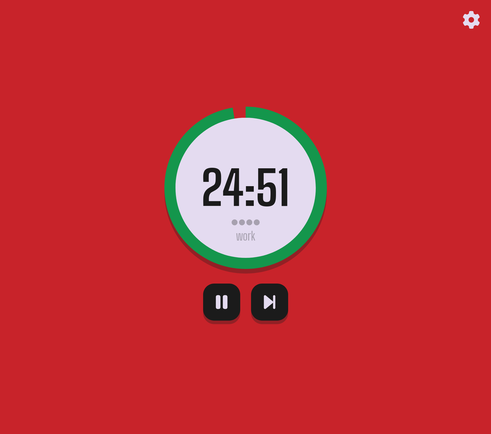

# 🍅 Pomodoro Timer

## What It Does 

The app allows you to:
- Set a simple Pomodoro timer complete with work, rest, and long rest cycles
- Keep track of how many work-rest intervals you've completed
- Adjust the length of the different cycles

## Project Structure

- Website version in `website/`
- Firefox extension version in `extension/`
- Basic trio of HTML + CSS + JS for both w/a shared `assets/` dir for now
- Firefox ext. includes `manifest.json` as required by all extensions! All files related to the popup are within `extension/popup/`.
- `biome.json` configures the Biome LSP for various web filetypes (namely HTML/JSON) which I use w/my Nvim config

## Notes

This is my first frontend project, so you may see some disasters in the code! Learning and getting it done was the main objective here :) 

## Screenshots

## Links

- [Figma board](https://www.figma.com/design/UtprImiaUWIsJWMZ5heeHJ/Pomotimer?node-id=0-1&t=6voRKGZpPIedE5DR-1)

## Roadmap

The web app is complete!

Currently working on a Firefox extension version, which is largely a a remake to both learn extension building and use slightly better coding practice than the web app based on what I learned. 

#### Checklist

- [ ] Timer HTML + CSS 
- [ ] Control buttons HTML + CSS
